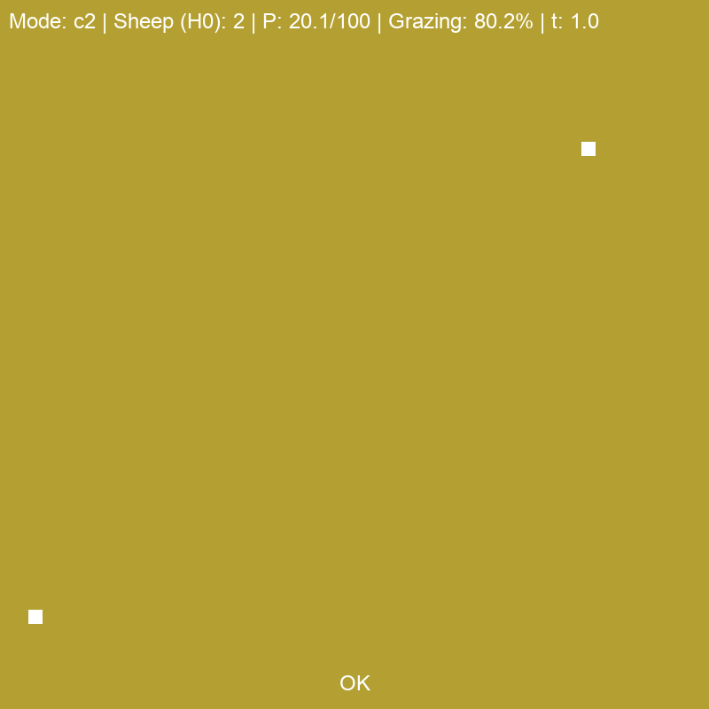
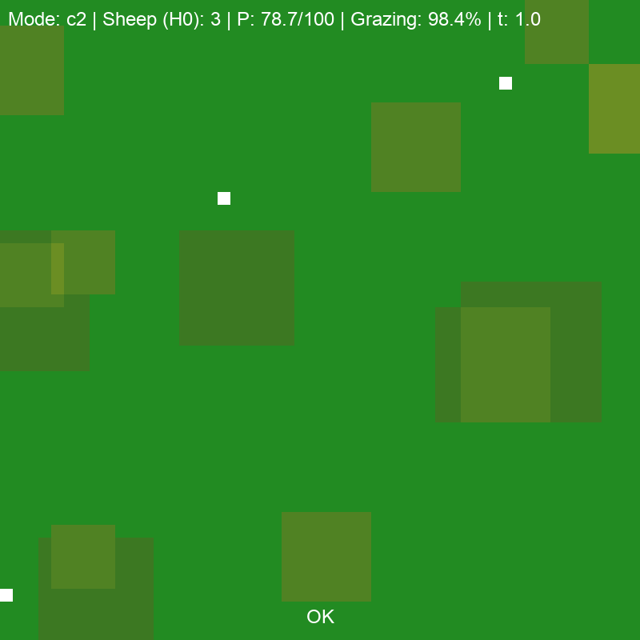
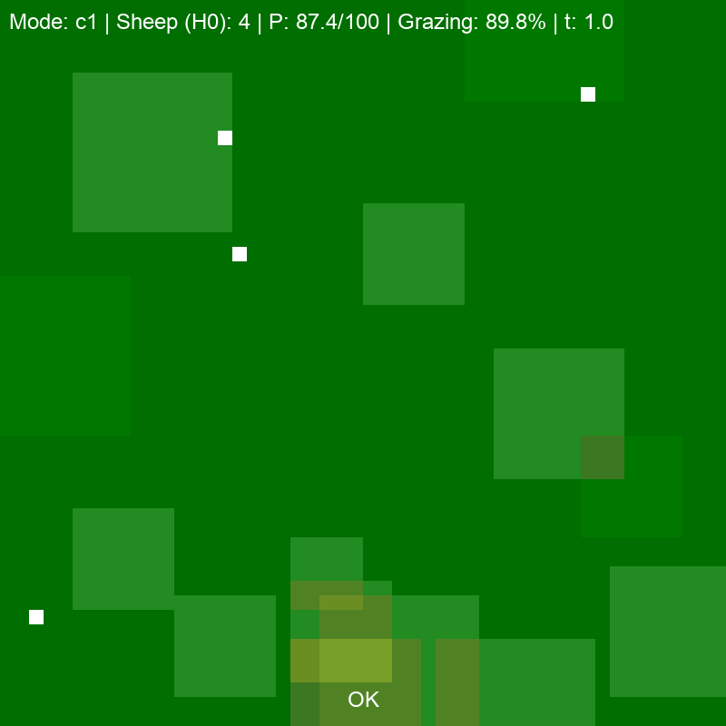

 # Sheep Grazing Model

A small, visual playground for 1‑dimensional predator–resource ODEs.

This project solves a single ODE representing a Lotka-Volterra model for pasture biomass over time (grass growth minus sheep grazing). On the screen, that 1D state is turned into a patchy 2D field with animated sheep wandering around and eating, so you can *see* the differential equation instead of just looking at curves.

## Gallery

These clips are generated from the simulation using `generate_gifs.py`.

After setting `config.yaml`, you can run 

`python generate_gifs.py --run-sim`.

**Healthy sustainable grazing.**

**Heavier herd with risk of malnourishment.**

**Very high pressure population, sheep will starve.**

## Model equations

The underlying model is a single ordinary differential equation for pasture biomass $P(t)$ grazed by a herd of fixed size $H_0$:

$$
\frac{dP}{dt} = r P \left(1 - \frac{P}{K} \right) - H_0 \ c(P),
$$

where:

- $P$ is pasture biomass,
- $r$ is the intrinsic growth rate,
- $K$ is the carrying capacity,
- $H_0$ is the (constant) number of sheep,
- $c(P)$ is the per‑sheep consumption rate (functional response).

Two functional responses are implemented in `sheep_model.py`:

**Type 1 (saturating hyperbolic)**

$$
c_1(P) = \frac{a P}{b + P},
$$

which increases with $P$ and saturates as $P \to \infty$.

**Type 2 (sigmoidal / more strongly saturating)**

$$
c_2(P) = \frac{a P^2}{b^2 + P^2},
$$

which has a low‑intake region at small $P$ and saturates sharper at higher $P$.

The simulation integrates this ODE forward in time using an explicit Euler step:

$$
P_{n+1} = P_n + \Delta t \, \frac{dP}{dt} (P_n),
$$

with time step $\Delta t = \texttt{DT}$ set in `config.yaml`.

## Files and structure

- `sheep_model.py` – ODE definition and numerical stepping for pasture biomass.
- `sheep_sim.py` – Pygame visualization and main simulation loop.
- `config_loader.py` / `config.yaml` – Parameter loading and defaults (growth, capacity, herd size, etc.).
- `generate_gifs.py` – Runs simulations, captures frames, and writes GIFs into `output/`.
- `output/` – Saved GIFs and optionally raw frame dumps.

## License / reuse

This project is intended as a teaching and experimentation tool for introductory mathematical modeling and differential equations. Feel free to fork it, tweak parameters, or repurpose the visualization for your own ODE demos.